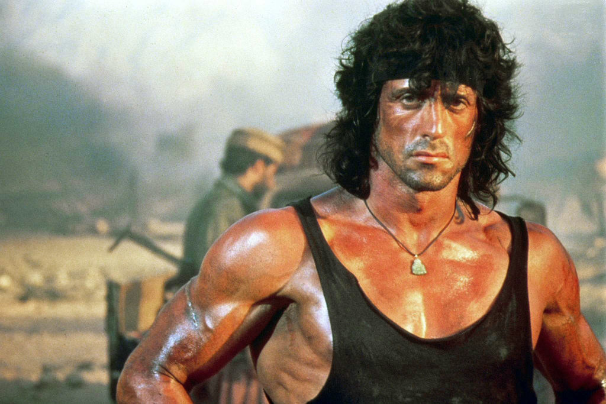

# Face Swap
Face swap algorithm using geometric approaches - warping with Triangulation and Thin Plate Splines. Achieved warping using full 3D mesh of faces from a supervised encoder-decoder neural network.

### Test data source image:

### Test data destination video:

### Output after using Thin plate spline for warping and applying Kalman Filter for smooth transition between frames:

